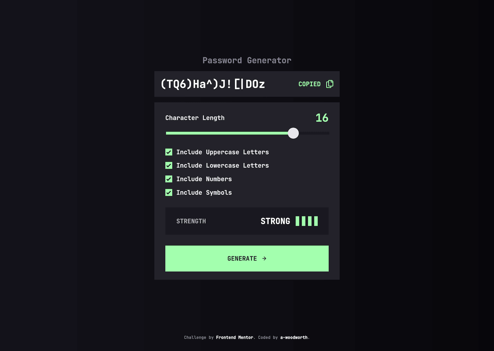
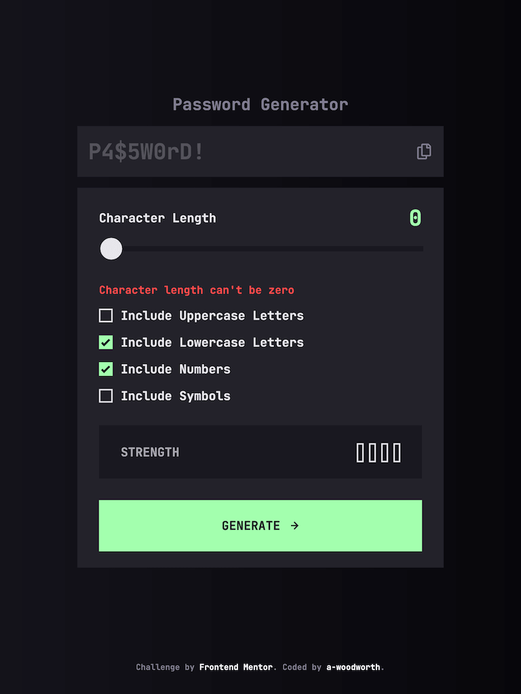
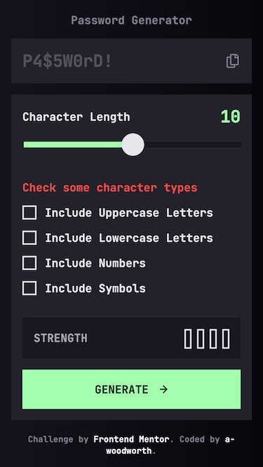

# Frontend Mentor - Password generator app solution

This is a solution to the [Password generator app challenge on Frontend Mentor](https://www.frontendmentor.io/challenges/password-generator-app-Mr8CLycqjh).

## Table of contents

- [Overview](#overview)
  - [The challenge](#the-challenge)
  - [Screenshots](#screenshots)
  - [Links](#links)
  - [Built with](#built-with)
  - [Useful resources](#useful-resources)

## Overview

### The challenge

Users should be able to:

- Generate a password based on the selected inclusion options
- Copy the generated password to the computer's clipboard
- See a strength rating for their generated password
- View the optimal layout for the interface depending on their device's screen size
- See hover and focus states for all interactive elements on the page

### Screenshots

**Desktop**

**Tablet**

**Mobile**

### Links

- Solution URL: [Solution]()
- Live Site URL: [Live Site](https://a-woodworth.github.io/password_generator_app)

### Built with

- Semantic HTML5 markup
- CSS Custom properties (variables)
- JavaScript
- [Sass](https://sass-lang.com/) - CSS Preprocessor
- Clipboard API

### Useful resources

- [MagentaA11y: How to test a range slider input](https://www.magentaa11y.com/checklist-web/range-slider/)
- [Sara Soueidan - Accessible Notifications with ARIA Live Regions(Part 1)](https://www.sarasoueidan.com/blog/accessible-notifications-with-aria-live-regions-part-1/)
- [Florian Schroiff - The Complete Guide to ARIA Live Regions for Developers](https://www.a11y-collective.com/blog/aria-live/)
